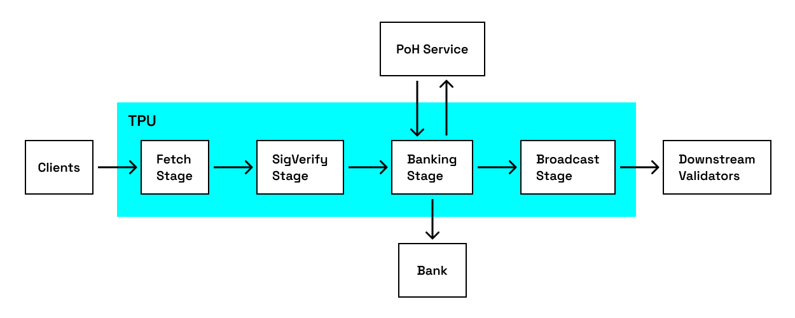

---
hide:
  - toc
---

It is not enough to be able to form a consensus and share a block with the rest of the network quickly. A node must validate and execute all those transactions in received blocks before another block comes. To address this, the Solana team developed the **Transaction Processing Unit (TPU)**. The TPU works as a processor and extensively uses pipelining.

!!! insight

    Pipelining is a common CPU optimization that helps keep the chip more utilized by splitting an instruction execution into stages. This method allows various hardware components to work in parallel, reducing idle time.

<h2>Stages of the TPU pipeline</h2>

1. **Data fetch:** Incoming data is fetched the in kernel space via network card.
2. **Signature verification:** The GPU handles signature verification.
3. **Banking:** Update of the state using the CPU.
4. **Write:** The processed transaction are written to the disk in the kernel space and broadcast via network card to the network.

!!! info

    There are two pipelined processes that Solana validators use:

    - The leader uses **Transaction Processing Unit (TPU)** to produce a new block.
    - Other validators use **Transaction Validation Unit (TVU)** to validate and propagate the block produced by the leader.
