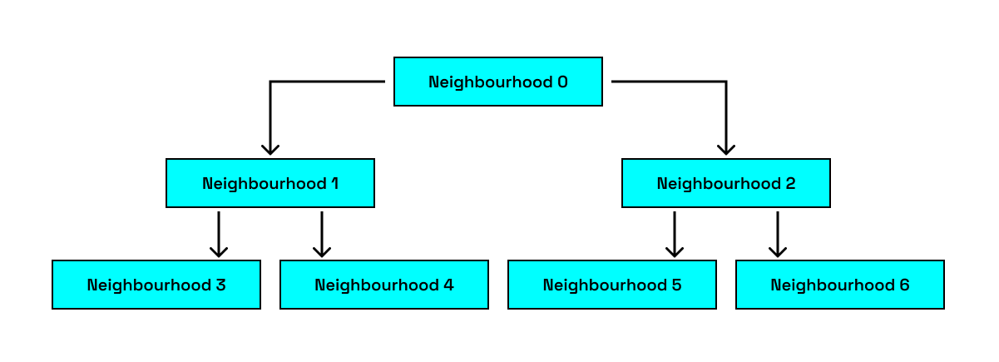

---
hide:
  - toc
---

Turbine is a block propagation protocol designed to reduce both time needed for block propagation as well as the overall message complexity, reducing the communication overhead of a node.

Nodes in the network are divided into small partitions called **neighborhoods**. Nodes within a particular neighborhood are responsible for sharing received data with other nodes in the same neighborhood and propagating the data to a small number of nodes in other neighborhoods.

!!! info

    The data unit shared is called a **shred**, and each block is composed of many shreds.

<h2>Problems with Broadcasting</h2>

Since we are in an adversarial environment, any node can decide not to rebroadcast the received shreds or broadcast incorrect data.

Countermeasures:

- **Erasure Codes** help by broadcasting a block with more shreds than necessary to reconstruct the entire block without errors, even if some shreds are lost along the way. With 6 data shreds and 3 additional redundant shreds, we can lose up to 1/3 of the shreds and still be able to reconstruct the entire block fully.

- A **stake-weighted selection algorithm** is used to create a tree where the risk of faulty or malicious nodes is minimized. Validators with the highest stake are positioned closer to the current leader.
