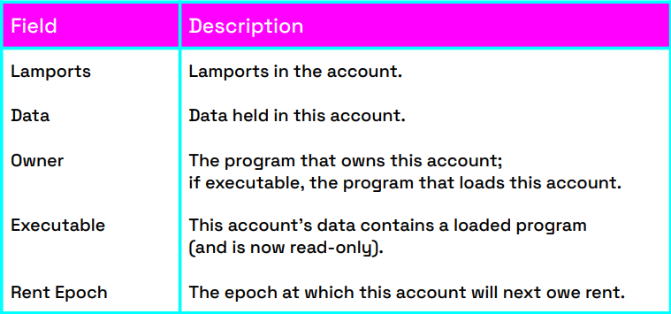

---
hide:
  - toc
---

<h2>Everything is an Account</h2>

Just as in UNIX, where "everything is a file", in Solana "everything is an account". In other words, an account is a memory buffer that functions similarly to a file in a file system. The main purpose of an account is to store state between instructions and transactions. Each account is identified by an address (a public key) and Solana’s account system can therefore be viewed as  key-value database.

!!! note

    The key may be one of the following:

    - An ed25519 public key.
    - A [program derived address (PDA)](./program-derived-address.md).

<h2>Account Anatomy</h2>

**1. Lamports**

  - The account balance is held in lamports.
  - 1 lamport = 10−9 SOL.

**2. Data**

  - Vector of bytes.
  - The maximum account data size is 10 MB.

!!! warning

    For **PDAs**, the limit is **10 KB** at the time of creation, but they can later be resized to a **maximum of 10 MB**.

**3. Owner**

  - The owner is either a program ID or a loader in case of an executable account.
  - All new accounts are owned by the System program which allows:
    -  Transfer of lamports.
    -  Data allocation.
    -  Assignment of ownership to a different program ID.

!!! info

    Program is granted **write access** only if the **owner matches its ID** (program owns the account).

!!! important

    An account is **always** owned either by a **program** or a **loader**.

**4. Executable**

  - Turning a non-executable account into an executable one is a one-way only operation.
  - The owner of such an account is a loader that will load the code from the data field of the account and start executing it if invoked.

!!! note

    Account becomes **read-only** it is made executable.

**5. Rent Epoch**

  - To maintain an account on Solana, a fee called rent has to be paid periodically.
  - An account is considered rent-exempt if it holds at least two years’ worth of rent.
  - Every epoch runtime checks whether the account should pay rent or is rent-exempt.

<h2>Account Types</h2>

There are 3 types of Solana accounts:

1. **Data accounts**: These accounts serve as containers for storing and retrieving data.
2. **Program accounts**: These accounts store user-deployed executable bytecode.
3. **Native accounts**: These accounts hold Solana's built-in programs such as the System program, the BPF Loader, and others.
