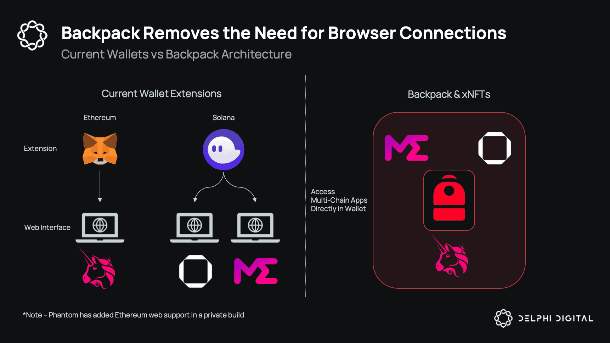

# Executable NFT

Executable NFTs, available in the open beta of new open source wallet Backpack, represent an entirely new way to build applications that are safer, better to use, and in line with the decentralized values blockchain is built on. By combining executable websites and applications that can run locally on a user’s computer with a crypto wallet, xNFTs in Backpack show a promising new type of hybrid web3 application – not quite an application, not quite a website.

xNFTs take a radically practical approach to solving two of web3’s main problems today, decentralization and distribution, with profound implications. While smart contracts run on globally distributed and decentralized networks like Solana, nearly everyone who interacts with smart contracts does so through a website. These centralized, web2 interfaces, and the services that run them, often require the project to register a company, open a bank account, obtain a business debit or credit card, register a domain, and a whole host of other actions just to provide users with a graphical user interface. Each step in that process takes time, money, and adds a potential source of risk for the project’s creators.

xNFT Collections unlock whole new avenues for program distribution. A game developer can mint their entire game as limited-edition xNFTs. A DeFi protocol can distribute early access to a new front-end based on wallet addresses. A two-factor code can be generated as an NFT, and automatically cycle through. An artist can create beautiful immersive 3d experiences that can’t be copied, and run directly in the wallet. The possibilities are almost limitless.

Because they are, at their core, NFTs, xNFTs can bring a new level of interactivity to traditional collections. The first xNFT Collection, Mad Lads, showcases the power of an executable profile picture collection — the pictures themselves act as a chatroom for users which is rendered entirely within the NFT.

xNFTs are not some new smart contracting language, a scaling solution, or a core technology that will take years to deploy. They exist today. This is just one of the many ecosystem-wide innovations that have supercharged the Solana protocol and greater community.

