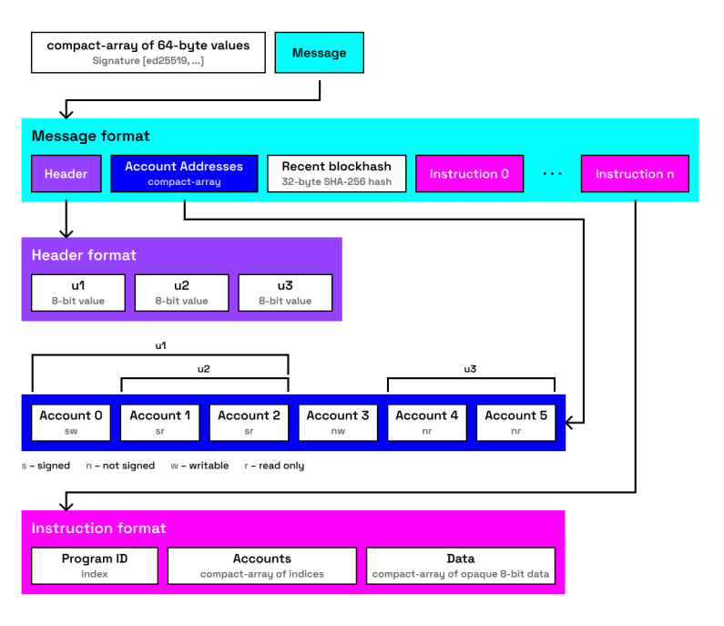
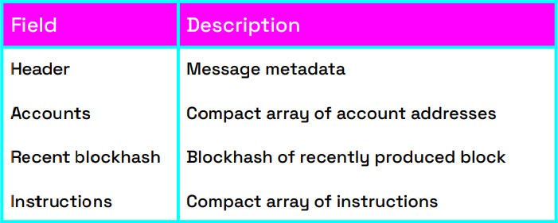

<h2>Key Elements</h2>

???+ important

    <dt><b>Signature</b></dt>
    A 64 bytes long digital signature in the ed25519 format that verifies the authenticity and integrity of a transaction.

    <dt><b>Account</b></dt>
    A record in the Solana ledger that serves as a storage space for user data or an executable program.

    <dt><b>Compact Array</b></dt>
    An array-like data structure that starts with a 16-bit encoded array length, followed by the array elements.

    <dt><b>Blockhash</b></dt>
    A unique hash that identifies a block produced as a part of the Proof of History algorithm.

    <dt><b>Program ID</b></dt>
    The public key of an account that stores a compiled program on the blockchain.

    <dt><b>Instruction</b></dt>
    A command that specifies the Program ID to be executed, the accounts involved, and additional data that the program can use to determine the action to be performed.

<h2>Transaction Anatomy</h2>

**Solana transactions consist of two major parts in the following order:**

- A compact array of signatures.
- A message that contains a compact array of account addresses, a recent blockhash and a compact array of instructions.

<h3>Signatures</h3>

**For each signature in the compact array, the Solana verifies two conditions:**

- The number of signatures must match the first 8 bits of the message header.
- Each signature is validated against the corresponding public key at the same index in the account addresses array.

<h3>Message Layout</h3>

**1. Header**

  - Number of required signatures in the transaction (8 bits).
  - Number of read-only accounts requiring signatures (8 bits).
  - Number of read-only accounts not-requiring signatures (8 bits).

**2. Accounts**

  - Addresses that require signatures with read-write access.
  - Addresses that require signatures with read-only access.
  - Addresses that do not require signatures with read-write access.
  - Addresses that do not require signatures with read-only access.

**3. Recent blockhash**

  - <dt><b>Ensures transaction lifetime</b></dt>

    Transaction is deemed invalid if the blockhash is older than 150 blocks (approximately 1 minute).

  - <dt><b>Prevents transaction replay</b></dt>

    By tying each transaction to a unique recent blockhash, Solana ensures that identical transactions cannot be processed more than once.

**4. Instructions with the following anatomy:**

  - Program ID index.
  - Compact-array of account address indices.
  - Compact-array of opaque 8-bit data (what operations to perform and any additional data).

