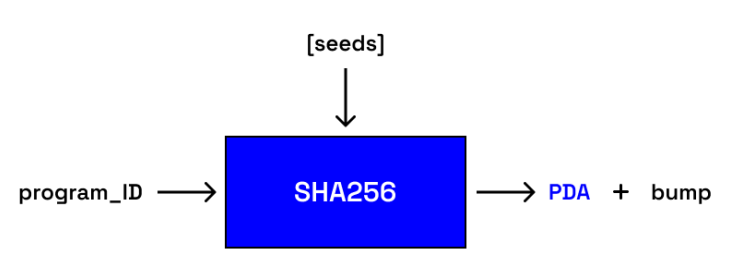

Cross Program Invocation (CPI) is a facility that allows us to call other programs from within an instruction. The caller is halted until execution returns from the callee. An important term associated with CPIs is a Program Derived Address (PDA).

## Program Derived Address (PDA)

Programs can issue instructions containing accounts that were not signed in the original transaction by using Program Derived Addresses (PDA). These accounts are called PDA accounts. Program-derived addresses allow programmatically generated signatures to be used when calling between programs.

PDA is an address deterministically derived from the program id and supplied keywords or more familiar seeds (Figure 1.8). If needed, the resulting address is checked against the Ed25519 curve and bumped off it with so-called bump seeds. Hence, there is no private key.

When a program tries to invoke a CPI with such an address, the runtime takes the supplied keywords and bump seeds, uses the caller’s program id, and repeats the process. If the resulting PDA matches, the account is considered to be signed.

